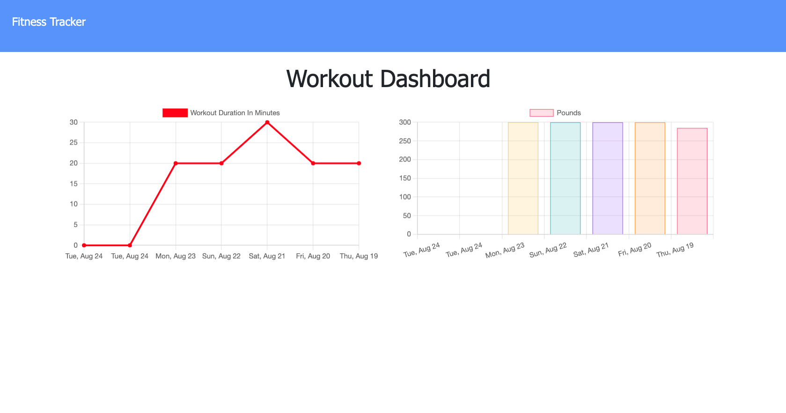
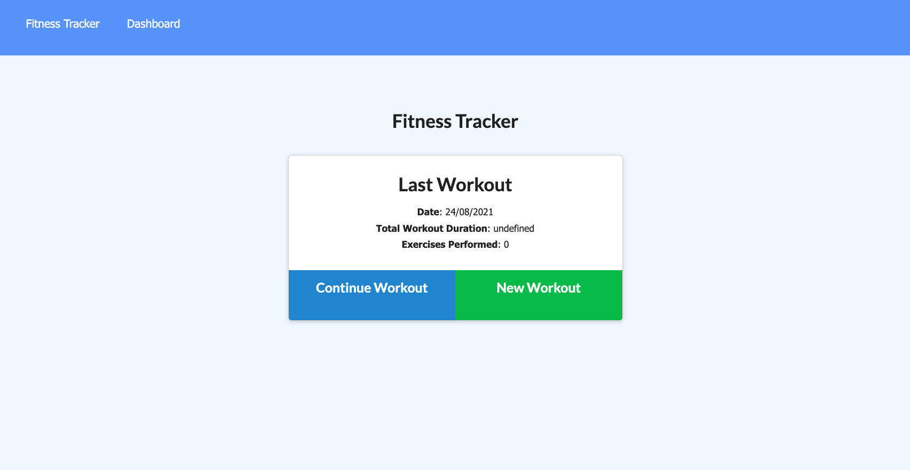

# Homework-18 Fitness Tracker

## Description

This fitness tracker app allows to track and reach fitness goals of an user by tracking the progress of the goal stablished. This app allows to track several types of exercises per day by selecting input such as workout name, weight, sets, repetitions, duration and type of workout.

It also allows the user to track the travelled distance should the workout be a travelled distance workout type.

## Technologies Used

The following technologies were used for the building process of the app:

- MongoDB and the Mongoose ODM for the database.

- Heroku for deployment

- Express for route handling

## Application screenshot

The following image is a screenshot of the app.

## Aplication deployment:

## Heroku:

### https://fitnesstracker89.herokuapp.com/

## Github:

### https://github.com/LuisBonilla89/Homework-18

## License

MIT License.
